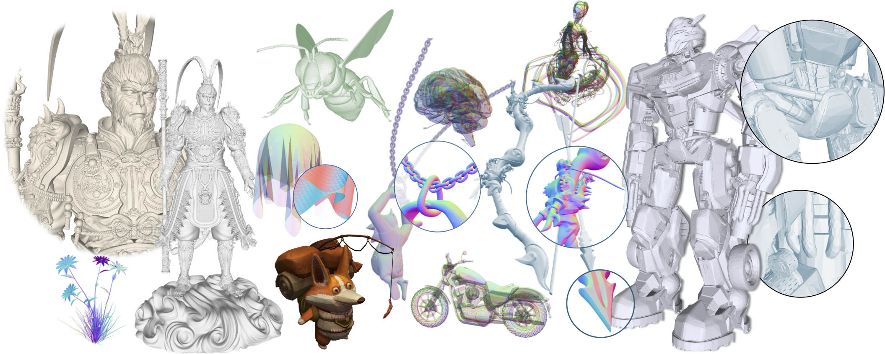
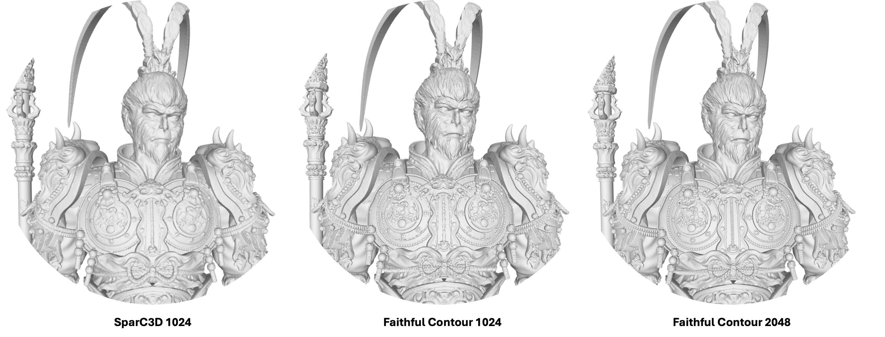

# Faithful Contouring


**Faithful Contouring**: A high-fidelity, near-lossless 3D mesh representation method that eliminates the need for distance-field conversion and iso-surface extraction.  
This official library provides a CUDA-accelerated **Encoder/Decoder pipeline** to transform arbitrary meshes into compact **Faithful Contour Tokens (FCTs)**, together with an efficient remeshing algorithm for precise reconstruction.


[](https://www.python.org/downloads/) [](https://pytorch.org/) [](https://arxiv.org/abs/xxx)  [](https://creativecommons.org/licenses/by-nc/4.0/)


[🔒 Source Code Not Fully Released Yet](src/)
## Overview

Conventional voxel-based mesh representations typically rely on distance fields (SDF/UDF) and iso-surface extraction through Marching Cubes and its variations. These pipelines require watertight preprocessing and global sign computation, which often introduce artifacts including surface thickening, jagged iso-surfaces, and loss of internal structures.

**Faithful Contouring** avoids these issues by directly operating on the raw mesh. It identifies all surface-intersecting voxels and solves for a compact set of local anchor features — a **primal anchor**, its eight **dual anchors**, and six **semi-axis orientations** — forming the **Faithful Contour Token (FCT)**.  


At the core of this method is the **Faithful Contour Tokens (FCT)** — a compact per-voxel representation.  
Each active voxel is represented by:
- one **primal anchor** (position + normal),
- up to eight **dual anchors** (positions + normals),
- and six **semi-axis orientations** indicating directional connectivity.

This design ensures:
- **High fidelity** – sharp edges and internal structures are preserved, even for open or non-manifold meshes.  
- **Scalability** – efficient CUDA kernels enable resolutions up to 2048+.  
- **Flexibility** – token-based format supports filtering, texturing, manipulation, and assembly for downstream applications.  

 

Faithful Contouring thus provides both a practical mesh processing pipeline and a standardized tokenized format (FCT) that can be directly integrated into learning-based 3D reconstruction and generative modeling. Check [here](imgs/Comparision_FCT.pdf) for detailed comparisons with traditional SDF+MC pipelines. VAE reconstruction results can be found [here](imgs/FCT_VAEComp.pdf).

## How It Works

The pipeline consists of two main components: an encoder and a decoder.

1.  **Encoder (`FCT_encoder`)**:
    - Takes a standard triangle mesh (vertices, faces) as input.
    - Performs a multi-level octree traversal from a coarse `min_level` to a fine `max_level`.
    - At each level, it uses fast, CUDA-based AABB intersection tests to prune empty regions and identify active cells for the next, finer level.
    - At the `max_level`, it runs a detailed intersection analysis on the final set of active primal and dual cells to compute precise feature points (as offsets from cell centers).
    - Outputs the two tensors that constitute the Faithful Contour Tokens。

2.  **Decoder (`FCT_decoder`)**:
    - Takes the `active_voxels_indices` and `FCT_features` tensors as input.
    - Reconstructs the absolute world-space positions of all primal and dual feature points.
    - Establishes connectivity between primal and dual points based on the primal-dual grid structure.
    - Generates triangular faces by connecting each primal point to its valid dual neighbors, perfectly restoring the original mesh topology.

## FCT Format
Encoding produces two main tensors:

- **`active_voxels_indices`** `[K]`  
  Linear indices of active primal voxels.

- **`FCT_features`** `[K, 69]`  
  Per-voxel features containing:
  - **Primal anchor**: position (3) + normal (3)  
  - **Dual anchors**: 8 positions (8×3) + normals (8×3), with mask (8)  
  - **Semi-axis directions**: 6 orientation flags (±x, ±y, ±z)  

> - Not all features are mandatory; Only the dual masks, anchor positions, and semi-axis directions are essential for reconstruction. 
> - Texture and Semantic Partitions can be attached as additional channels in `FCT` for advanced applications.
      

## Installation

This project requires a system with an NVIDIA GPU, CUDA Toolkit, and a C++ compiler.

#### 1. Prerequisites: Install PyTorch

First, you must install a version of PyTorch that matches your system's CUDA Toolkit. Please visit the [PyTorch official website](https://pytorch.org/get-started/locally/) to get the correct command for your specific setup. For example, for CUDA 11.8:
```bash
pip3 install torch torchvision torchaudio --index-url [https://download.pytorch.org/whl/cu118](https://download.pytorch.org/whl/cu118)
```
*(You may also need to install a compatible version of PyTorch3D if you use the filtering functions.)*

#### 2. Clone and Install `faithcontour`

Once PyTorch is installed, clone this repository and install the library using pip.

```bash
# Clone the repository
git clone https://github.com/Luo-Yihao/FaithC.git
cd FaithC

# Install the library in editable mode
# This will compile the C++/CUDA code and install the Python package.
pip install -e .
```

## Usage

The provided `demo.py` script is the easiest way to use the encoder/decoder pipeline.

**To encode a mesh into the Faithful Contour Tokens (FCT) format and immediately decode it back:**
```bash
python demo.py -p assets/examples/pirateship.glb -r 512 -o output/pirateship.glb
```

**Command-Line Arguments:**
- `path`: (Optional) Path to the input mesh file. Default: Spherical Polyhedron.
- `res`:   (Optional) Final grid resolution. Must be a power of two. Default: `512`.
- `output`: (Optional) Path for the output reconstructed mesh file. Default: `reconstructed_mesh.obj`.
- `rescale`: (Optional) Rescaling factor for mesh normalization into [-1, 1]. Default: `0.95`.
- `if_simplify`: (Optional) Whether to simplify the output mesh using quadric edge collapse decimation. Default: `True`.

Use `python demo.py --help` to see all options.

## Library API

You can also import `faithcontour` directly into your own projects.

```python
import torch
import trimesh
import faithcontour as fc

# --- Load and Normalize Mesh ---
mesh = trimesh.load("my_model.obj")
mesh = fc.normalize_mesh(mesh, rescalar=0.95)

V = torch.tensor(mesh.vertices, dtype=torch.float32)
F = torch.tensor(mesh.faces, dtype=torch.long)
N_F = torch.tensor(mesh.face_normals, dtype=torch.float32)

# --- Encoding ---
# Set parameters
MAX_LEVEL = 9 # Corresponds to a 512^3 grid
solver_weights = {'lambda_n': 1.0, 'lambda_d': 1e-3, 'area_power': 1.0}

FCT_dict = fc.FCT_encoder(
    vertices=V,
    faces=F,
    face_normals=N_F,
    max_level=MAX_LEVEL,
    solver_weights=solver_weights,
    device='cuda',
    output_mode='dict'
)

# You can now save `active_indices` and `features` to disk.

# --- Decoding ---
resolution = 1 << MAX_LEVEL
recon_points, recon_faces = fc.FCT_decoder(
    FCT_dict
    resolution=resolution
)

# Create a trimesh object from the decoded data
final_mesh = trimesh.Trimesh(recon_points.cpu().numpy(), recon_faces.cpu().numpy())
final_mesh.export("reconstructed_mesh.glb")
```

## Roadmap

- [ ] Algorithm Code Release
- [ ] Faithful Contour Tokens based VAE Release
- [ ] Diffusion Model Release

## License

Distributed under the Attribution-NonCommercial 4.0 International License. See `LICENSE` for more information.

## Contact

Yihao Luo - y.luo23@imperial.ac.uk

Project Link: [https://github.com/Luo-Yihao/FaithC](https://github.com/Luo-Yihao/FaithC)